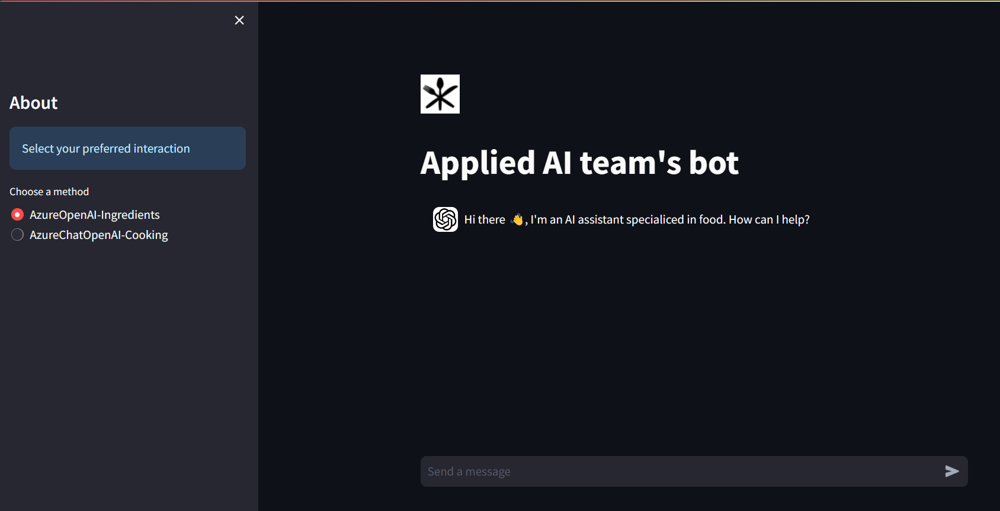

# Azure-streamlit-chatbot
A sample demonstrating how to create a streamlit-chatbot (LLM-powered) User Interface and use Azure OpenAI for demo purposes. 
This sample is in python and uses [Streamlit](https://streamlit.io/) to deploy a chat interface.

**Original repo can be found here**: [streamlit_app](https://github.com/microsoft/azure-streamlit-chatbot)

## Usage

The sample can be run locally OR deployed to Azure web app as a Docker container.

1. **To run the streamlit app locally:**
   1. In a terminal `streamlit run ./streamlit_app/main.py --server.port 8000`
   2. open a web browser at `localhost:8000`

2.  **Optional: Build and run Docker container locally** (requires [docker installed locally](https://docs.docker.com/engine/install/))
    1. build the docker container `docker build -t bot:v1 .`
    2. run the docker container locally `docker run --rm -p 8000:8000 bot:v1`
    3. open a web browser and type `localhost:8000`